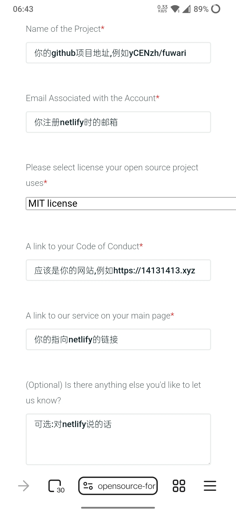

# Netlify开源计划

## 什么是开源计划

Netlify 开源计划（Netlify Open Source Plan）是 Netlify 面向开源项目维护者推出的一项 永久免费 的 Pro 级托管方案。凡托管在 GitHub 且以 OSI 认可许可证发布的公共开源仓库，通过简单的申请表单即可获得无限团队成员、每月 100 GB 带宽、1,000 分钟构建时长及全球 CDN 等 Pro 功能，帮助项目在零成本下实现持续集成、自动部署和 Pull Request 预览。  
讲人话就是可以为你的开源项目免费申请和pro计划同等资源的***开源计划***,pro计划每月19$,换算成CNY大约每月136,大善人太帅了

## 怎么申请

<https://opensource-form.netlify.com/>

打开申请入口,填写相关信息后提交

一天之后将会收到已开通 Open Source 计划的邮件。如果没有通过也没关系，你可以直接用魔法打败魔法，让gpt用英文和他对线

通过后账户也自动从 Starter 升级到了 Open Source 计划

享受和pro计划同等的资源